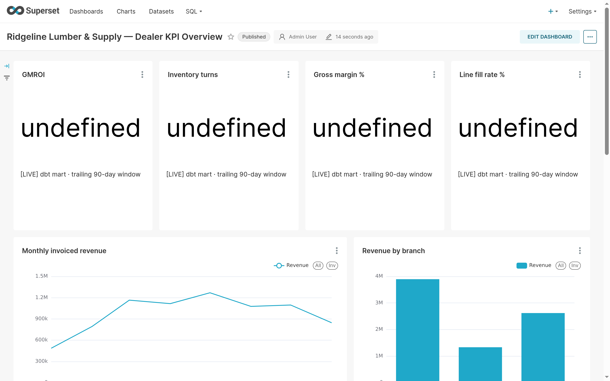
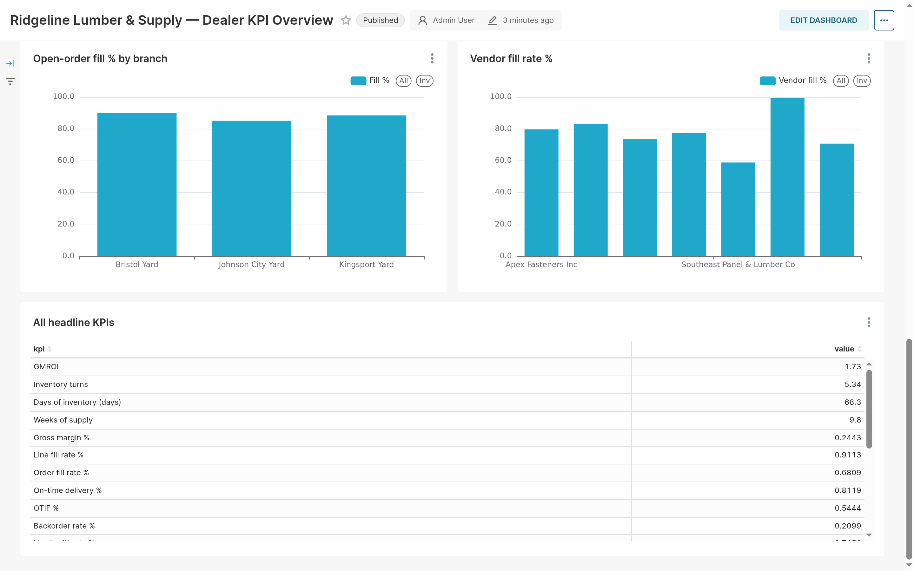

# ERP Control Plane for Construction Supplies Distribution

A reusable, deployable data platform for a roll-up acquiring 2–3 building-
materials dealers per month, each running a different ERP. Connectors isolate
per-ERP extraction; one canonical model and one KPI catalog standardize the
books; the control plane tracks sources, watermarks, crosswalks, and data
quality. **Status: v0.1 — CSV/SFTP path works end to end; other ERPs are
coded-but-unexercised adapters or documented skeletons (see maturity below).**

## Architecture (one screen)

```
dealer ERPs ──connectors──▶ Parquet lake (staging, provenance-stamped)
                                │
        control-plane store ◀───┤  registry · watermarks · file hashes ·
        (SQLite/Postgres)       │  quarantine · crosswalks · DQ results
                                ▼
        Dagster (software-defined assets, asset checks)
                                ▼
        dbt OSS (DuckDB target): staging → canonical → marts
                                ▼
              DuckDB analytics · Apache Superset (optional `bi` profile)
```

Locked decisions and rationale: [docs/ARCHITECTURE.md](docs/ARCHITECTURE.md).
Data model, grains, crosswalk + COA patterns: [docs/DATA_MODEL.md](docs/DATA_MODEL.md).

## Quickstart (10 minutes)

Prereqs: Python 3.11+ and Docker (only for `make up`). The demo itself needs
no Docker.

```bash
cp .env.example .env          # demo defaults are fine; no credentials needed
make install                  # pip install pinned deps into your venv
make demo                     # seeded dealer: extract → dbt build → KPI report
```

`make demo` runs the fictional **Ridgeline Lumber & Supply** dealer export
through the real `csv_sftp` connector (manifest validation, checksums,
idempotency), builds all dbt models + tests against DuckDB, and prints the
20-KPI headline. Re-running it extracts 0 new rows (idempotent) and rebuilds
the marts. Expected headline values: GMROI ≈ 1.73, turns ≈ 5.34, gross margin
≈ 24%, line fill ≈ 91%.

Useful next commands:

```bash
make up                       # postgres + dagster webserver/daemon (localhost:3000)
make up BI=1                  # ... + Apache Superset (localhost:8088)
python -m connectors.cli --help   # plan / register / extract / status
make test && make lint
```

## Repo shape

| Path | What it is |
|---|---|
| `connectors/` | Connector SDK (`base.py` contract), config-driven registry (`sources.yml`), adapters per ERP |
| `dbt/` | One dbt project: per-source staging → canonical (Kimball) → KPI marts + tests |
| `orchestration/` | Dagster code location: extraction assets, dbt assets, checks, demo job |
| `control_plane/` | Registry/config/secrets plumbing; SQLite + Postgres stores |
| `analytics/` | Superset datasets/SQL + RLS & embedding notes |
| `demo/` | The end-to-end demo runner |
| `seed/` | Deterministic seeded dealer export + manifest (checksums) |
| `scripts/` | Seed generator and utilities |
| `tests/` | Connector contract suite (all sources), CSV/SFTP end-to-end, seed integrity |
| `docs/` | ARCHITECTURE, DATA_MODEL, CONNECTOR_GUIDE, ONBOARDING_RUNBOOK |

## Connector maturity (first wave)

| ERP | Surface | Status |
|---|---|---|
| Generic CSV/SFTP | files + manifest | ✅ working end to end (demo + tests) |
| NetSuite | SuiteQL / TBA | ⚙️ coded, credential-gated, `--dry-run`; **never exercised against a live tenant** |
| BisTrack | read-only SQL/ODBC · Smart View API | 📝 documented skeleton (dual mode) |
| DMSi Agility | REST | 📝 documented skeleton |
| Epicor Prophet 21 | SQL / OData | 📝 documented skeleton |
| Epicor Eclipse | REST (Caché) | 📝 documented skeleton |
| ECI Spruce / RockSolid MAX | SOAP + CSV fallback | 📝 documented skeleton |
| Dynamics 365 BC | API v2 + BACPAC backfill | 📝 documented skeleton |

Skeletons document the real extraction surface and stop at
`ConnectorNotImplemented` — no invented API behavior. Add yours per
[docs/CONNECTOR_GUIDE.md](docs/CONNECTOR_GUIDE.md).

## Onboarding a new acquisition

[docs/ONBOARDING_RUNBOOK.md](docs/ONBOARDING_RUNBOOK.md) — day 1/30/60/90 per
dealer: connect ERP → reconcile books → crosswalk masters → map COA →
KPI sign-off → scheduled increments.

## Security notes

- No credentials in the repo; `.env.example` holds placeholders only. Source
  config references `${VARS}` resolved from the environment.
- Every row is provenance-stamped (`source_system`, `source_id`,
  `source_doc_no`/`source_line_no` on facts, `loaded_at`) for audit trails.
- Superset deployments must configure RLS per dealer/branch
  (`analytics/README.md`).

## Dealer KPI dashboard (Apache Superset)

The Ridgeline dealer KPI dashboard, provisioned idempotently by
[`analytics/superset/build_dashboard.py`](analytics/superset/build_dashboard.py)
(start it with `make up BI=1`):





## Demo API (serverless-ready)

`api/index.py` is a lean FastAPI + DuckDB API over the seeded dealer data — the
Vercel-deployable entrypoint for this repo (wired via `[tool.vercel] entrypoint`
in `pyproject.toml`; serverless deps in `requirements.txt`). The heavy pipeline
(Dagster, dbt, Superset, Postgres) is not deployed serverless — use Docker
Compose for the full topology.

- `GET /` — service info (HTML landing page for browsers, JSON for API clients)
- `GET /health` — liveness + data provenance
- `GET /data/summary` — per-domain row counts, date spans, headcount
- `GET /kpis` — the full 21-metric headline KPI set

KPIs are computed with the same definitions as the dbt marts
(`dbt/models/marts/`) and pinned to the dbt-built `main_marts.kpi_headline`
values by `tests/test_kpi_api.py`.

Production: the demo API is deployed on Vercel at
**https://construction-supplies-erp-control-plane.vercel.app** (`GET /health`,
`GET /kpis`). Pushes to `main` deploy automatically via the GitHub integration
(the commit author email must match a Git account); `.vercelignore` keeps the
upload to the API surface for manual `npx vercel deploy --prod` runs.

Local run:

```bash
pip install -e ".[dev]"
make api   # uvicorn api.index:app on :8000
```
